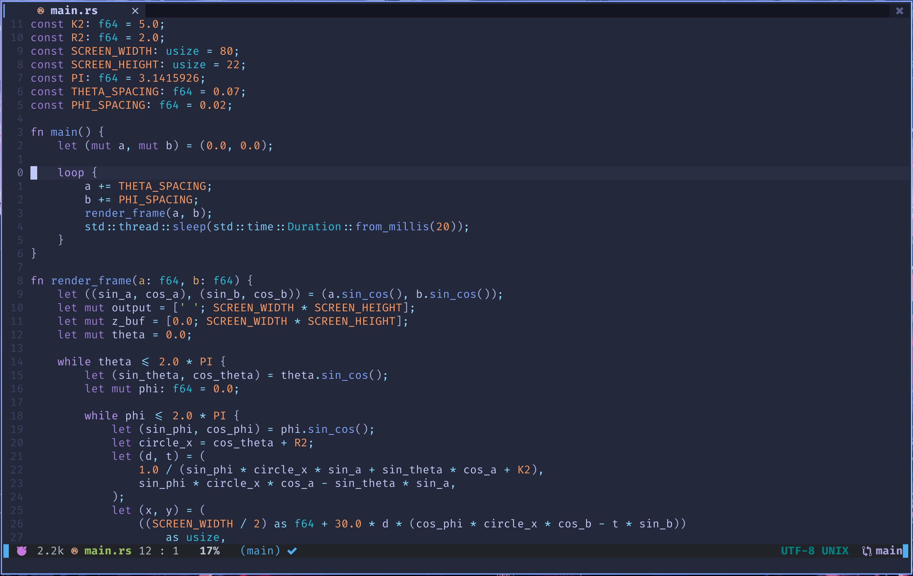
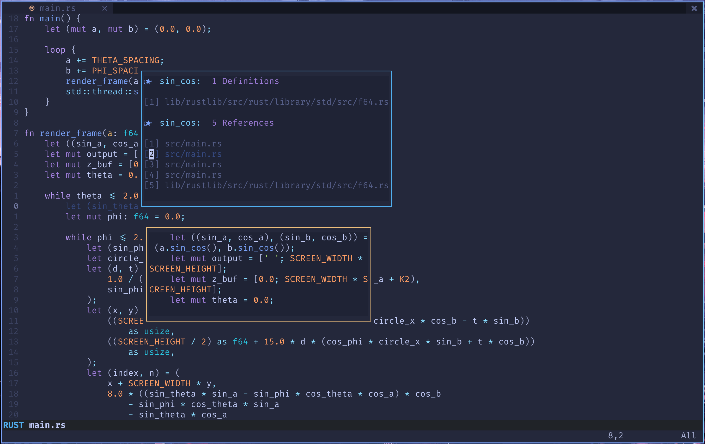
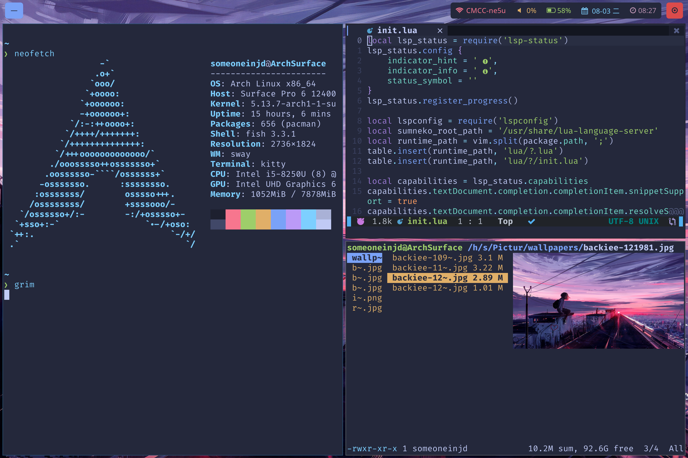
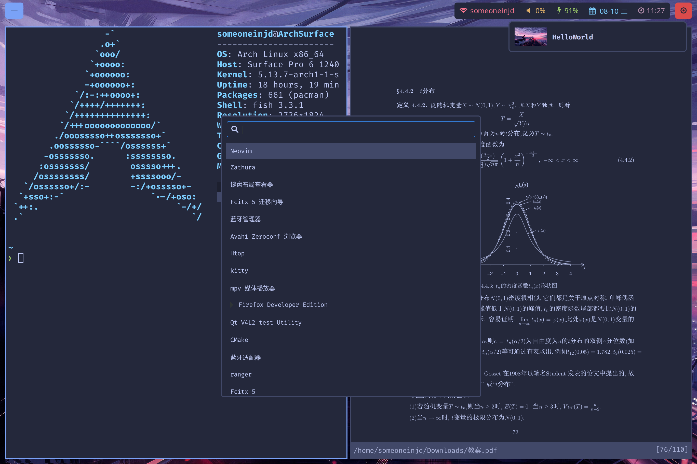
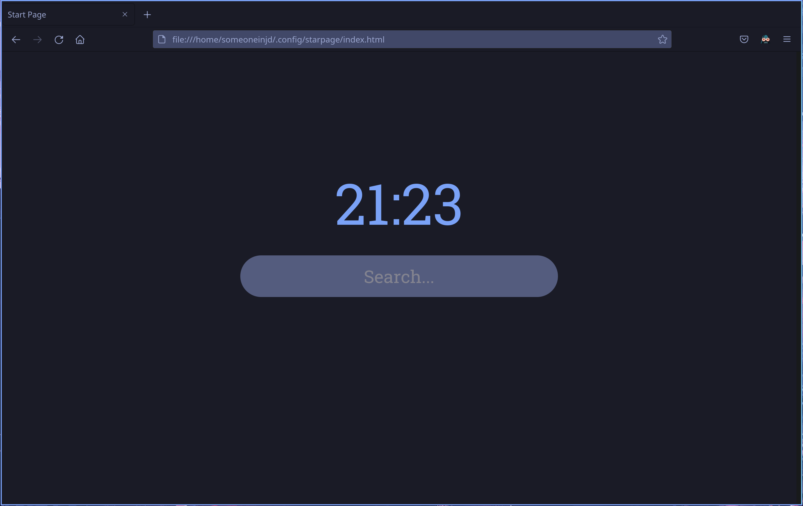

# dotfiles
My Arch config

## Software

* Terminal: [kitty](https://sw.kovidgoyal.net/kitty/)
* Colorscheme: [tokyonight](https://github.com/folke/tokyonight.nvim)
* Shell: [fish](http://fishshell.com/)
* WM: [sway](https://github.com/swaywm/sway)
* DM:  [tuigreet](https://github.com/apognu/tuigreet)
* Editor: [neovim](http://neovim.org/)
* Bar: [waybar](https://github.com/Alexays/Waybar)
* IME: [rime-cloverpinyin](https://github.com/fkxxyz/rime-cloverpinyin)
* File Manager: [ranger](https://ranger.github.io/)
* Brightness: [brightnessctl](https://github.com/Hummer12007/brightnessctl)
* PDF Reader: [zathura](https://git.pwmt.org/pwmt/zathura)
* Screen Locker: [swayidle](https://github.com/swaywm/swayidle) [swaylock](https://github.com/swaywm/swaylock)
* Screenshot: [grim](https://github.com/emersion/grim) [slurp](https://github.com/emersion/slurp)
* Notify: [mako](https://github.com/emersion/mako)
* Shell Prompt: [starship](https://github.com/starship/starship)
* Launcher:  [wofi](https://hg.sr.ht/~scoopta/wofi) 
* Browser: [firefox](https://www.firefox.com) (with tokyonight theme)
* Startpage: [here](./tokyonight/config/startpage/)

## Neovim Config

See [here](./tokyonight/config/nvim/)

## Neovim Screenshots

## Screenshots

