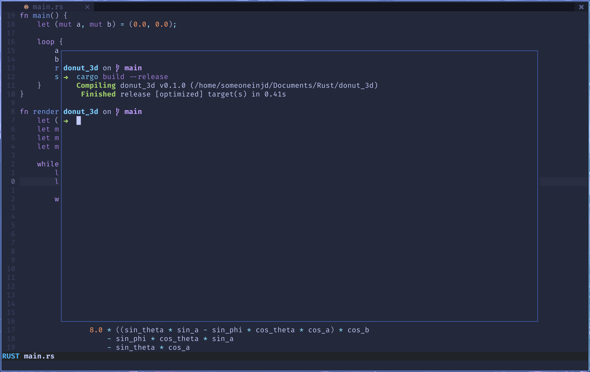

# Neovim Config

This is my neovim configurations(pure lua)

## Guide for lua in neovim

* [nvim-lua-guide](https://github.com/nanotee/nvim-lua-guide)

## Other Configurations

[here](../nvim-coc/) is my old configuration(pure vimscript), and [here](../nvim-min/) is a minimal configuration without external dependencies.

## Plugins

* Plugin Manager: [packer.nvim](https://github.com/wbthomason/packer.nvim)
* LSP:
    * Basic config: [nvim-lspconfig](https://github.com/neovim/nvim-lspconfig)
    * Enhanced UI: [lspsaga.nvim](https://github.com/glepnir/lspsaga.nvim)
* Diagnostic Info:
    * List for showing diagnostics: [trouble.nvim](https://github.com/folke/trouble.nvim)
    * Diagnostics highlight groups: [lsp-colors.nvim](https://github.com/folke/lsp-colors.nvim)
* Signature Help: [lsp_signature.nvim](https://github.com/ray-x/lsp_signature.nvim)
* Completion: [nvim-compe](https://github.com/hrsh7th/nvim-compe)
* Snippet: [LuaSnip](https://github.com/L3MON4D3/LuaSnip)
* Finder: [telescope.nvim](https://github.com/nvim-telescope/telescope.nvim) 
* File Explorer: [nvim-tree.lua](https://github.com/kyazdani42/nvim-tree.lua)
* Syntax Highlighting: [nvim-treesitter](https://github.com/nvim-treesitter/nvim-treesitter)
* Autopairs: [nvim-autopairs](https://github.com/windwp/nvim-autopairs)
* Terminal: [lspsaga.nvim](https://github.com/glepnir/lspsaga.nvim)
* Format: [formatter.nvim](https://github.com/mhartington/formatter.nvim)
* Statusline:
    * Basic statusline: [galaxyline.nvim](https://github.com/glepnir/galaxyline.nvim)
    * LSP client's statusline component: [lsp-status.nvim](https://github.com/nvim-lua/lsp-status.nvim)
* Bufferline: [nvim-bufferline.lua](https://github.com/akinsho/nvim-bufferline.lua)
* Colorscheme: [tokyonight.nvim](https://github.com/folke/tokyonight.nvim)

## Key Bingings

| Key         | Action                                    |
| ----------- | ----------------------------------------- |
| Meta + e    | Toggle file explorer                      |
| Meta + t    | Open terminal(floating)                   |
| Meta + f    | Format code                               |
| Meta + n    | Goto next tab                             |
| Meta + p    | Goto previous tab                         |
| Meta + d    | Close current tab/terminal                |
| gh          | Show all references and declaration       |
| gr          | Rename                                    |
| ga          | Code Actions                              |
| K           | Hover                                     |
| Leader + xx | Show all diagnostic messages              |
| Leader + ff | Search files                              |
| Leader + fg | Live grep                                 |
| Leader + fb | Search buffer                             |

## Screenshots

